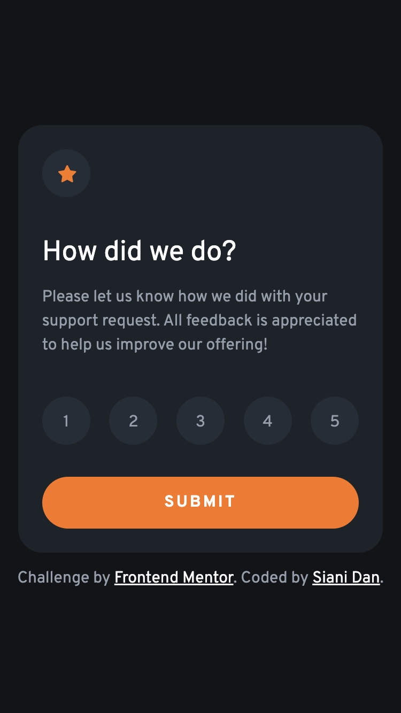
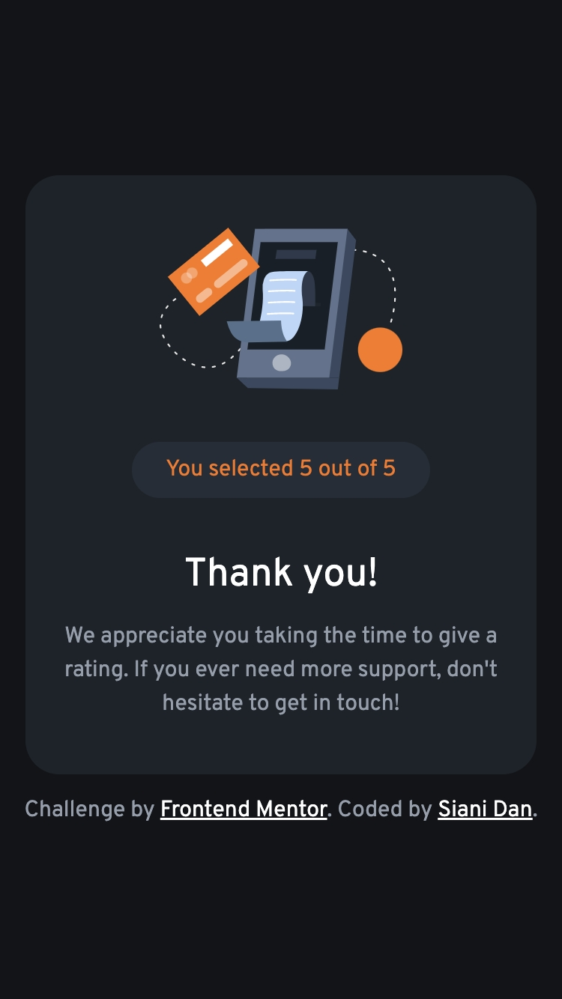
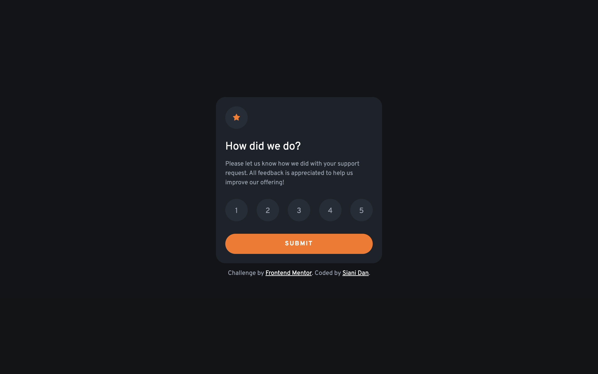
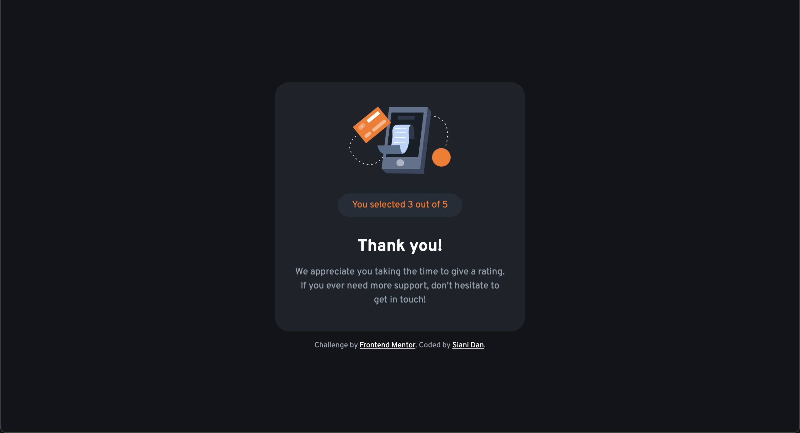

# Frontend Mentor - Interactive rating component solution

This is a solution to the [Interactive rating component challenge on Frontend Mentor](https://www.frontendmentor.io/challenges/interactive-rating-component-koxpeBUmI). Frontend Mentor challenges help you improve your coding skills by building realistic projects. 

## Table of contents

- [Overview](#overview)
  - [The challenge](#the-challenge)
  - [Screenshot](#screenshot)
  - [Links](#links)
- [My process](#my-process)
  - [Built with](#built-with)
  - [Continued development](#continued-development)
  - [Useful resources](#useful-resources)
- [Author](#author)

## Overview

### The challenge

Users should be able to:

- View the optimal layout for the app depending on their device's screen size
- See hover states for all interactive elements on the page
- Select and submit a number rating
- See the "Thank you" card state after submitting a rating

### Screenshot

#### Mobile

#### Desktop

### Links

- [Solution URL](https://www.frontendmentor.io/solutions/responsive-rating-component-with-flexbox-ZsjgUvPXYR)
- [Live Site URL](https://sianidan.github.io/Interactive-Rating-Component)

## My process

### Built with

- Semantic HTML5 markup
- CSS custom properties
- Flexbox
- Mobile-first workflow
- Vanilla JavaScript

### Continued development

In the future, I would like to explore how the rating data from a component like this is collected and stored on the server side.

### Useful resources

Overall, this project was well within the scope of my JS knowledge, so I didn't have to do too much research on the side. Using a static node list was a big part of my solution, however, so I believe this could be a helpful resource for anyone else trying to complete this challenge.

- [Node Lists](https://developer.mozilla.org/en-US/docs/Web/API/NodeList) - The MDN explains the difference between live and static node lists and some example use cases.

## Author

- GitHub - [Siani Dan](https://github.com/sianidan)
- Frontend Mentor - [@sianidan](https://www.frontendmentor.io/profile/sianidan)